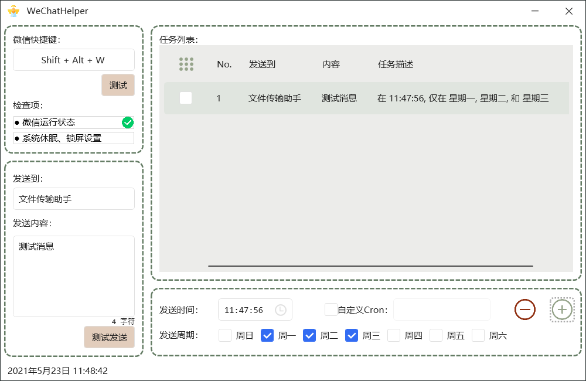
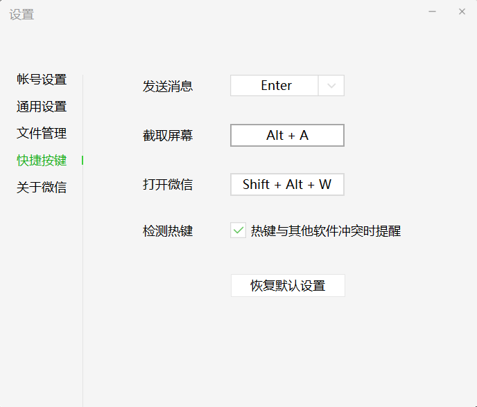

# WeChatHelper
- 一个简单微信助手应用；
- 基本原理是模拟按键（快捷键）操作完成功能，不依赖应用程序底层数据接口（得支持快捷键操作，也可以模式鼠标）；
- 添加定时任务调度的功能；
- 理论上可以实现任何应用程序一定程度上的自动化；

### UI

> 基于C# WPF [HandyControl](https://github.com/HandyOrg/HandyControl)控件库开发

### 基本使用

1. 设置打开微信快捷键；

2. 设置发送对象和发送内容；
3. 设置发送时间（支持自定义[Cron]( https://zh.wikipedia.org/wiki/Cron)表达式）；
4. 添加、删除任务；

### TODO

1. 系统锁屏后模拟按键操作失败，且不支持模拟用户认证（输入密码）功能；
2. 设置信息保存到配置文件；
